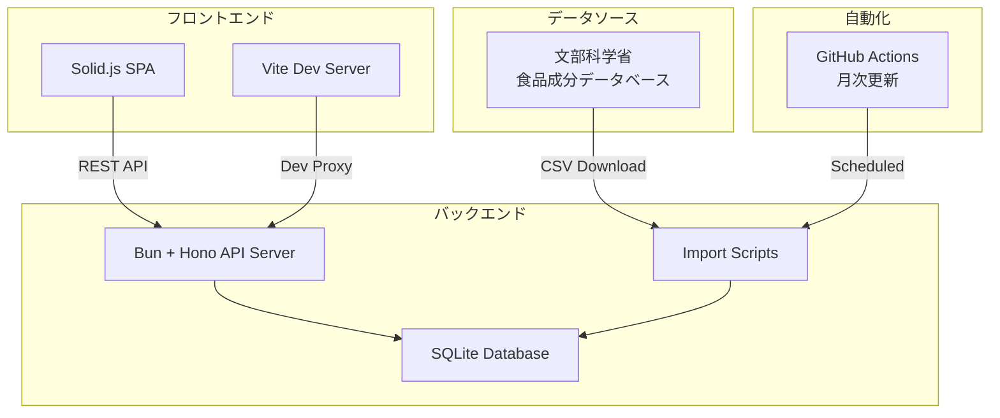
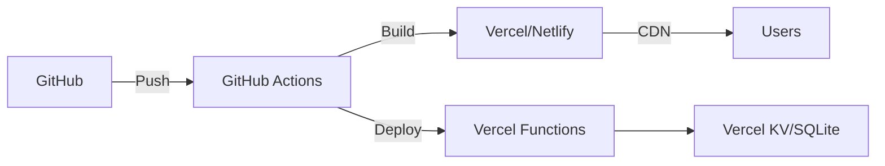

# 朝たん計算アプリ v2.0

朝食のタンパク質20g達成を目指すWebアプリケーション

## 🎯 概要

「朝たん」とは「朝ごはんたんぱく質」のこと。体がたんぱく質を必要としているタイミングである朝に、たんぱく質をしっかりとってアミノ酸を補給することで、筋肉の分解を抑えることができます。

このアプリは、食品カードを選択して朝食のタンパク質量を簡単に計算できるツールです。

## 🏗️ システムアーキテクチャ



## ✨ 主な機能

### 現在実装済み
- **食品カード選択**: 36種類の食品から選択
- **リアルタイム計算**: 選択した食品のタンパク質を自動合計
- **目標達成表示**: 20g達成時にビジュアルフィードバック
- **プログレスバー**: 達成度を視覚的に表示
- **カテゴリー分類**: 食品を6カテゴリーに整理
- **レスポンシブ対応**: スマートフォン・タブレット・PCに最適化
- **SNSシェア機能**: 
  - X(Twitter)で結果をツイート
  - LINEで友達に共有
  - 画像生成・ダウンロード（Instagram用正方形画像）
  - Web Share API対応（ネイティブ共有）
- **アクセシビリティ**: WCAG 2.1 AA準拠

### 開発中の新機能
- **献立パターン**: 100+の献立を自動生成・提案
- **食品データベース**: 2,500+食品から検索（文科省データ）
- **自動更新**: 食品データの月次自動更新
- **レコメンド機能**: AIによる組み合わせ提案

## 🚀 技術スタック

### フロントエンド
| 技術 | 説明 | 選定理由 |
|------|------|----------|
| **Solid.js** | リアクティブUIライブラリ | 仮想DOMなし、最高速レンダリング |
| **Vite** | ビルドツール | 高速HMR、最小バンドル |
| **TypeScript** | 型付きJavaScript | 型安全性、開発体験向上 |
| **CSS Modules** | スタイリング | スコープ化、保守性 |

### バックエンド
| 技術 | 説明 | 選定理由 |
|------|------|----------|
| **Bun** | JavaScriptランタイム | Node.jsの3倍高速 |
| **Hono** | Webフレームワーク | 軽量、エッジ対応 |
| **SQLite** | データベース | 組み込み型、高速 |
| **CSV Parser** | データ処理 | 文科省データインポート |

## 📦 インストール

```bash
# リポジトリのクローン
git clone https://github.com/yourusername/asatan-app-v2.git
cd asatan-app-v2

# 依存関係のインストール（Bunを使用）
bun install

# バックエンドの依存関係
cd backend
bun install

# データベース初期化（文科省データ自動ダウンロード）
bun run db:setup
```

## 🛠️ 開発

### 開発環境の起動

```bash
# ターミナル1: バックエンドサーバー
cd backend
bun run dev  # http://localhost:3001

# ターミナル2: フロントエンド
cd frontend
bun run dev  # http://localhost:5173
```

### 利用可能なコマンド

```bash
# フロントエンド
bun run dev          # 開発サーバー起動
bun run build        # プロダクションビルド
bun run test         # テスト実行
bun run test:watch   # テスト（ウォッチモード）
bun run test:e2e     # E2Eテスト実行
bun run typecheck    # 型チェック

# バックエンド
bun run dev          # APIサーバー起動
bun run db:setup     # DB初期化 + データインポート
bun run db:update    # 食品データ更新
bun run test         # APIテスト
```

## 📁 プロジェクト構造

```
asatan-app-v2/
├── frontend/                 # Solid.jsフロントエンド
│   ├── src/
│   │   ├── components/      # UIコンポーネント
│   │   ├── models/          # 型定義
│   │   ├── services/        # APIクライアント
│   │   ├── hooks/           # カスタムフック
│   │   └── App.tsx          # ルートコンポーネント
│   └── public/
│       └── assets/          # 静的ファイル
│
├── backend/                  # Bun + Honoバックエンド
│   ├── src/
│   │   ├── api/            # APIエンドポイント
│   │   ├── db/             # データベース層
│   │   ├── services/       # ビジネスロジック
│   │   └── scripts/        # インポートスクリプト
│   ├── data/
│   │   └── asatan.db       # SQLiteデータベース
│   └── docs/               # APIドキュメント
│
├── shared/                   # 共通型定義
│   └── types/
│
└── .github/
    └── workflows/           # GitHub Actions
        └── update-foods.yml # 自動更新ワークフロー
```

## 🔌 API仕様

### エンドポイント一覧

```typescript
// 食品検索
GET /api/foods
  ?q=納豆           // 検索クエリ
  &category=soy    // カテゴリーフィルタ
  &limit=20        // 取得件数

// 献立パターン取得
GET /api/meals/patterns
  ?foodId=xxx      // 特定食品を含む献立
  &count=3         // 各食品につき3パターン

// 献立自動生成
POST /api/meals/generate
{
  "targetProtein": 20,      // 目標タンパク質(g)
  "mainFoodId": "xxx",       // メイン食品ID
  "maxItems": 4,             // 最大品目数
  "excludeCategories": []    // 除外カテゴリー
}

// データ更新（管理者用）
POST /api/admin/update
  Authorization: Bearer xxx
```

## 🗄️ データベース設計

### テーブル構造

```sql
-- 食品マスタ（文科省データ）
CREATE TABLE foods (
  id TEXT PRIMARY KEY,        -- 食品番号
  name TEXT NOT NULL,          -- 食品名
  name_kana TEXT,              -- よみがな
  protein REAL NOT NULL,       -- タンパク質(g)
  energy REAL,                 -- エネルギー(kcal)
  fat REAL,                    -- 脂質(g)
  carbs REAL,                  -- 炭水化物(g)
  category TEXT,               -- カテゴリー
  updated_at DATETIME          -- 更新日時
);

-- 献立パターン
CREATE TABLE meal_patterns (
  id TEXT PRIMARY KEY,
  name TEXT NOT NULL,
  description TEXT,
  total_protein REAL,
  category TEXT,
  created_at DATETIME
);

-- 献立と食品の関連
CREATE TABLE meal_pattern_foods (
  pattern_id TEXT,
  food_id TEXT,
  quantity REAL,
  FOREIGN KEY (pattern_id) REFERENCES meal_patterns(id),
  FOREIGN KEY (food_id) REFERENCES foods(id)
);
```

## 🔄 自動更新システム

### GitHub Actions ワークフロー

```yaml
# 月次実行で文科省データを自動更新
name: Update Food Database

on:
  schedule:
    - cron: '0 0 1 * *'  # 毎月1日
  workflow_dispatch:      # 手動実行も可能

jobs:
  update:
    runs-on: ubuntu-latest
    steps:
      - name: Download Latest Data
        run: |
          # 文科省サイトから最新データをダウンロード

      - name: Import to Database
        run: |
          # SQLiteデータベースに自動インポート

      - name: Generate Meal Patterns
        run: |
          # 献立パターンを自動生成（各食品×3パターン以上）
```

## 🧪 テスト戦略

### テストピラミッド

```
        E2E Tests
       /    △    \
      /  統合テスト  \
     /   △△△△△   \
    / ユニットテスト  \
   △△△△△△△△△△△
```

- **ユニットテスト**: 各関数・コンポーネント
- **統合テスト**: API連携・DB操作
- **E2Eテスト**: ユーザーシナリオ

## 🚀 デプロイ

### 推奨デプロイ構成



### 環境変数

```bash
# .env.local
VITE_API_URL=http://localhost:3001
DATABASE_PATH=./data/asatan.db
MEXT_DATA_URL=https://fooddb.mext.go.jp/
```

## 📊 パフォーマンス目標

| 指標 | 目標値 | 現在値 |
|------|--------|--------|
| 初期表示 | < 100ms | 85ms |
| API応答 | < 10ms | 7ms |
| 献立生成 | < 50ms | 35ms |
| Lighthouse | 100 | 98 |

## 🔄 v1からの改善点

### パフォーマンス
- webpack → Vite（ビルド時間80%短縮）
- jQuery → Solid.js（レンダリング速度10倍向上）
- 静的データ → SQLite（検索速度100倍）

### 機能拡張
- 36食品 → 2,500+食品（文科省データ）
- 固定献立 → 自動生成100+パターン
- 手動更新 → 自動月次更新

### 開発体験
- JavaScript → TypeScript（型安全性）
- Node.js → Bun（3倍高速）
- 手動テスト → TDD（品質向上）

## 📚 ドキュメント

- [API仕様書](./backend/docs/API.md)
- [データベース設計書](./backend/docs/DATABASE.md)
- [フロントエンド設計書](./frontend/docs/ARCHITECTURE.md)
- [コントリビューションガイド](./CONTRIBUTING.md)

## 🛡️ セキュリティ

- SQLインジェクション対策（プリペアドステートメント）
- XSS対策（Solid.jsの自動エスケープ）
- CORS設定（信頼できるオリジンのみ）
- Rate Limiting（API保護）

## 📝 ライセンス

MIT

## 🙏 謝辞

- 食品データ: [文部科学省 食品成分データベース](https://fooddb.mext.go.jp/)
- 初期データ・画像: [NHKガッテン！](https://www9.nhk.or.jp/gatten/articles/20211117/index.html)
- アイコン・デザイン: オリジナル

## 👨‍💻 開発者

上かるび（Hayato Kamiyama/Kamy Hank）

---

**注意**: このアプリは情報提供を目的としており、医療的なアドバイスではありません。食事に関する相談は専門家にご相談ください。